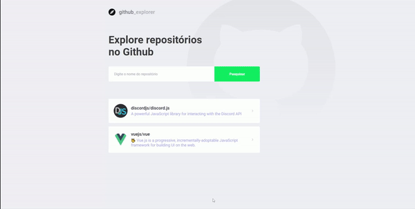

<h1 align="center">
    
</h1>

   

  <a href="#rocket-tecnologias">Tecnologias</a>&nbsp;&nbsp;&nbsp;|&nbsp;&nbsp;&nbsp;
  <a href="#-projeto">Projeto</a>&nbsp;&nbsp;&nbsp;|&nbsp;&nbsp;&nbsp;
  <a href="#-estrutura">Estrutura dos Arquivos</a>&nbsp;&nbsp;&nbsp;|&nbsp;&nbsp;&nbsp;
  <a href="#-como-contribuir">Como Instalar</a>&nbsp;&nbsp;&nbsp;|&nbsp;&nbsp;&nbsp;
  <a href="#memo-licença">Licença</a>

 

  

  

## :rocket: Tecnologias

Esse projeto foi desenvolvido com as seguintes tecnologias:

- [ReactJS](https://pt-br.reactjs.org/)
- [Typescript](https://www.typescriptlang.org/)
- [Estyled Components](https://styled-components.com/)
- [Eslint](https://eslint.org/)
- [Prettier](https://prettier.io/)

## 💻 Sobre o projeto

Esse prejeto foi feito para consumir a api do github e você pode adicionar seus repositórios favoritos e ver algumas informações sobre ele como o numero de stars, forks e inssues abertas.
Esse projeto é parte do curso GoStack da Rocketseat.

## 🤔 Como Instalar

Clone o reposítório com o comando abaixo:
<code>git clone https://github.com/ev4ndropc/github-explorer.git</code>

Instale as dependências
<code>yarn</code>

Rode o projeto com o comando
<code>yarn start</code>

## ⚙️ Estrutura

├─ .editorconfig
├─ .eslintignore
├─ .eslintrc.json
├─ package.json
├─ prettier.config.js
├─ public
│  ├─ index.html
│  └─ robots.txt
 |   └─ favicon.ico
├─ src
│  ├─ App.tsx
│  ├─ assets
│  │  ├─ github-background.svg
│  │  └─ logo.svg
│  ├─ index.tsx
│  ├─ pages
│  │  ├─ Dashboard
│  │  │  ├─ index.tsx
│  │  │  └─ styles.ts
│  │  └─ Repository
│  │     ├─ index.tsx
│  │     └─ styles.ts
│  ├─ react-app-env.d.ts
│  ├─ routes
│  │  └─ index.tsx
│  ├─ services
│  │  └─ api.ts
│  ├─ setupTests.ts
│  └─ styles
│     └─ global.ts
├─ tsconfig.json
└─ yarn.lock
---

Feito com ♥ by Evandro Pinheiro :wave: <a href="mailto:e_sayto@hotmail.com">Contato</a>
